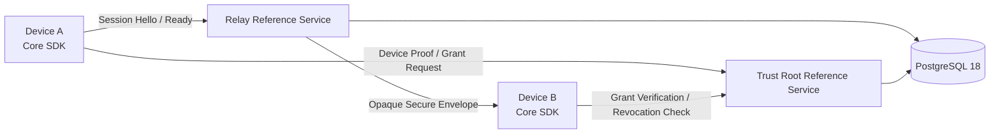

# Architecture

ISCP separates device identity, relay access, trust authorization, and payload
confidentiality into explicit boundaries.

## Components

## Core Boundaries

| Boundary | Owns | Must Not Own |
| --- | --- | --- |
| Device | Long-term identity private key, session keys, plaintext payloads | Trust Root signing keys |
| Relay | Access credentials, opaque queueing, delivery receipts | End-to-end session keys, plaintext payloads |
| Trust Root | Device authorization, Trust Grants, revocation state | Relay access tokens, device private keys |
| PostgreSQL | Repository state, raw/canonical signed bytes, audit logs | Credential plaintext, private keys, session keys |

## Data Flow

1. A device creates its long-term Ed25519 identity locally.
2. The Trust Root verifies device proof and authorization policy.
3. The Trust Root signs Trust Grants for scoped sensitive operations.
4. Devices establish forward-secret session keys with signed Session Hello
   objects and `session.ready` key confirmation.
5. Devices send encrypted Secure Envelopes through the Relay.
6. The Relay authenticates relay access and returns delivery receipts without
   decrypting business payloads.

## Implementation Map

- `pkg/iscp`: protocol object construction, canonicalization, cryptography,
  sessions, envelopes, provisioning, logging, and storage interfaces.
- `pkg/server`: server-side policy, repositories, audit, queues, replay
  protection, rate limiting, PostgreSQL migrations, and HTTP helpers.
- `services/relay-reference`: reference relay service implementation.
- `services/trust-root-reference`: reference trust service implementation.
- `tools/iscp-cli`: CLI workflows and conformance report commands.
- `conformance`: executable compatibility and release validation runner.
